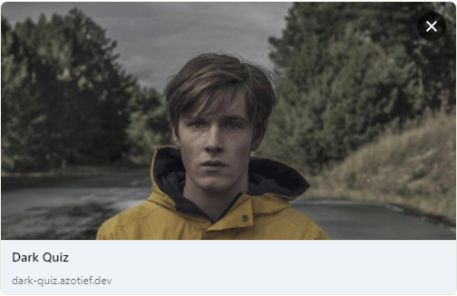

# ⁉ Dark Quiz ⁉

## 💻 Como rodar

**Faça um clone deste repositório e acesse a pasta do projeto**

```bash
$ git clone https://github.com/azotief/dark-quiz.git && cd dark-quiz
```

**Siga os passos a seguir**

```bash
# Instalar todas as dependências
$ yarn

# Execute o comando abaixo para rodar o projeto
$ yarn dev

# Pronto! O projeto está rodando no endereço: http://localhost:3000.
```

## 🚀 Desafios

✔ **Desafio do Paulo:** Implemente a meta tag og:image utilizando a mesma imagem do background.



## 📝 Licença

Este projeto está licenciado sob a Licença **MIT** - consulte o arquivo [LICENSE](LICENSE) para obter detalhes.

## 🌐 Deploy
URL de produção deste quiz:

https://dark-quiz.azotief.dev

---

🚀 Feito por **Bruno Fernando Feitoza** &nbsp; | &nbsp;[Meu LinkedIn](https://www.linkedin.com/in/brunofeitoza634/)